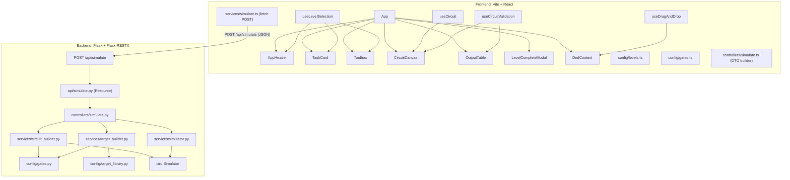

# QMCB Full Codebase Inventory

## Project Identity

- **Name:** QMCB — Quantum Circuit Builder
- **Concept:** A browser-based puzzle game where players build quantum circuits to match target unitary transformations (truth tables)
- **Monorepo layout:**
  - `QMCB-be/` — Flask + Cirq Python backend
  - `QMCB-fe/` — Vite + React + TypeScript frontend
- **Current branch:** `main`; 6 commits total (initial → cleanup → multi-level support → CZ fix + modal → README)
- **HTML page title:** "The CNOT Game — SWAP Prototype" (outdated)

---

## Architecture Overview

**Data flow:** Player drops gates onto circuit → "Check Solution" → `buildRequestFromLevel` builds `UnitaryRequestDTO` → `POST /api/simulate` → Flask validates → `simulate_unitaries` runs both circuits through Cirq → truth tables returned → frontend compares trial vs target row-by-row.

---

## Backend: `QMCB-be/`

### Framework & Boot

- **Flask 3.1.1** + **Flask-RESTX 1.3.0** (Swagger at `/api/docs`) + **flask-cors 6.0.1**
- **Quantum engine:** Cirq 1.6.0
- **Python:** 3.11.12
- Boot: `python -m app.main` → `Config()` (dotenv) → `create_app()` → `api.init_app(app)`
- Double CORS application (once in `__init__.py`, once in `main.py`) — minor redundancy

### Endpoints

| Method | Path            | Handler                                  |
| ------ | --------------- | ---------------------------------------- |
| POST   | `/api/simulate` | `Simulate.post` in `app/api/simulate.py` |
| GET    | `/api/docs`     | Swagger UI (Flask-RESTX default)         |

**No other routes exist.**

### Every Backend File

`**app/main.py`** — Entry point; logging config; loads `Config`; builds Flask app; second CORS wrapper for `/api/*`; `api.init_app(app)`; `__main__` runner.

`**app/__init__.py`** — `create_app(config)` factory: `Flask(__name__)`, `app.config.from_object`, applies CORS from `ALLOWED_ORIGINS`.

`**app/settings.py**` — `Config` class loaded from `.env`:

- `ALLOWED_ORIGINS` — CORS whitelist
- `API_VERSION` — `v1`
- `SECRET_KEY`
- `MONGO_URI` — configured but **unused** (no MongoDB code exists)
- `VALIDATE_TARGET_CIRCUITS` — boolean flag controlling live-simulation vs stored-table path for target

`**app/api/__init__.py`** — Flask-RESTX `Api` with `prefix="/api"`, `doc="/docs"`; registers `simulate_ns`.

`**app/api/simulate.py`** — `Simulate(Resource)` — parses JSON → builds `UnitaryDTO` + extracts `target_unitary` name → calls `simulate_unitaries` → uses `ResponseBuilder`.

`**app/controllers/simulate.py**` — `simulate_unitaries(trial_dto, target_name, validate_target)`:

1. Generates all basis states for `n` qubits
2. For each basis state, builds and simulates the trial circuit (wavefunction)
3. Optionally builds/simulates target circuit (`VALIDATE_TARGET_CIRCUITS=True`) or reads from stored `expected_outputs` in `TARGET_LIBRARY`
4. Returns dict with trial truth table, optional target truth table, validation mode flag
5. **Bug:** response key `"validation_mode:"` contains a trailing colon

`**app/services/circuit_builder.py`** — `CircuitBuilder` (all static methods):

- `prepare_basis_state(basis_state, qubits)` — X gates for |1⟩ bits
- `build_circuit_base(gates, qubit_order, qubits)` — applies each gate via `CirqGateMapper`
- `construct_unitary_circuit(basis_state, gates, qubit_order, qubits)` — prep + base
- `measure_qubits(qubits)` — `cirq.measure` with letter keys

`**app/services/simulator.py`** — `CircuitSimulator` (all static methods):

- `simulate_wavefunction(circuit, qubits)` — Cirq wavefunction simulation, returns Dirac notation string
- `wavefunction_truth_table(...)` — appends input ket + output to `TruthTableDTO`
- `run_and_measure` / `measurement_truth_table` — sampling path (not used by main controller)
- `simulate_and_update` — main path: wavefunction sim → append to truth table

`**app/services/target_builder.py**` — `TargetUnitaryBuilder`:

- `build(name, qubits)` — looks up `TARGET_LIBRARY[name]["steps"]`, applies each gate
- `get_unitary(name, qubits)` — legacy hard-coded circuits for CNOT_FLIPPED, CONTROLLED_Z, SWAP, CNOT

`**app/config/gates.py**` — `CirqGateMapper.apply(gate, qubit_order, *qubits)`:

- Maps string gate names → Cirq operations
- **Supported gates:** CNOT, H, X, Y, Z, S, T, Rx, Ry, CZ, SWAP

`**app/config/target_library.py`** — `TARGET_LIBRARY` dict:

- Keys: `CNOT_FLIPPED`, `CONTROLLED_Z`, `SWAP`
- Each entry: `num_qubits`, `steps` (gate + order), `expected_outputs`

`**app/dto/`** — Data transfer objects:

- `UnitaryDTO` — `number_of_qubits`, `gates`, `qubit_order`
- `TruthTableDTO` — `input: list[str]`, `output: list[str]`
- `ResponseDTO` — generic kwargs wrapper

`**app/utils/constants.py**` — Enums: `Basis`, `Gate`, `TargetLibraryField`, `HttpStatus`, `RequestKey`; qubit count constants.

`**app/utils/types.py**` — TypedDicts: `TargetLibraryEntry`, `GateStep`, `LevelDefinition`; Cirq type aliases.

`**app/utils/helpers.py**` — Pure functions: `initialize_qubit_sequence`, `generate_basis_states`, `set_qubit_to_1`, `get_target_gates`, `get_qubit_order`, `index_to_letter`, `list_to_joint_string`, `format_ket`, `extract_wavefunction`, `build_target_truth_table`, `extract_results`.

`**app/utils/response_builder.py**` — `ResponseBuilder.success / fail / error` → JSON responses.

`**app/utils/qubit_orders.py**` — Named qubit order lists: `Q0`, `Q1`, `C0_T1`, `C1_T0`.

`**testing/mwe.py**` — Broken: calls `simulate_unitaries` with wrong signature.
`**testing/bug_testing.py**` — Broken: imports missing `app.repositories.*` package.

---

## Frontend: `QMCB-fe/`

### Framework & Stack

- **Vite 5** + **React 18** + **TypeScript** (ES2020, strict)
- **Styling:** Tailwind CSS 3 + PostCSS + Autoprefixer
- **State:** React local state + TanStack Query v5 (`useMutation` only)
- **Drag & Drop:** `@dnd-kit/core` v6; `@dnd-kit/sortable` installed but **unused**
- **No client-side router** — single page, level is in-app state only

### Every Frontend File

`**src/main.tsx`** — `createRoot`, `QueryClientProvider`, renders `<App />`.

`**src/App.tsx`** — Root component; wires all four hooks; `DndContext` + `DragOverlay`; two-column layout; renders all panels + modal. Note: `DragOverlay` only has glyph cases for `tool-cnot`, `tool-h`, `tool-t` — other tools render no overlay content.

`**src/index.css**` — `@tailwind` layers; sets `html/body/#root` to `height: 100%`.

**Components:**

- `**AppHeader.tsx`** — Title bar; level `<select>` from `LEVEL_ORDER`; placeholder Settings/About `href="#"` links (non-functional).
- `**TaskCard.tsx`** — Level description + static expected truth table from level config.
- `**Toolbox.tsx**` — Draggable gate grid + labels + tip text. Receives `activeId` prop from `App.tsx` but **does not use it** (prop mismatch).
- `**CircuitCanvas.tsx`** — Two-wire SVG circuit; droppable strips; placed gate rendering (CNOT/CZ glyphs for 2-qubit, letter blocks for 1-qubit); per-gate order dropdown + Remove; "Check Solution" + "Clear Circuit" buttons.
- `**OutputTable.tsx`** — Trial vs target truth table comparison; per-row ✓; error display; "Level Complete ✓" banner.
- `**LevelCompleteModal.tsx**` — Full-screen overlay; "Repeat Level" (clears circuit) + optional "Next Level →" button.
- `**GateDesign.tsx**` — Stateless SVG glyphs: `CNOTGlyph`, `ControlledZGlyph`, `HGlyph`, `TGlyph`, `SGlyph`, `RXGlyph`, `RYGlyph`, `UGlyph`.
- `**DragAndDropWrappers.tsx**` — `DraggableTool` (wraps `useDraggable`); `DroppableStrip` (wraps `useDroppable`, shows dashed border when `isOver`).

**Hooks:**

- `**useCircuit.ts`** — `gates` state array; `addGate`, `removeGate`, `clearGates`, `setGateOrder`.
- `**useLevelSelection.ts`** — `currentLevel` (defaults to `SWAP_LEVEL`); `changeLevel(level, callback?)`.
- `**useCircuitValidation.ts**` — `useMutation(simulateUnitary)`; `toTruthRows`; `handleCheck` (builds request → mutate).
- `**useDragAndDrop.ts**` — `activeId` state; maps tool IDs → `Gate` enum; `onDragEnd` dispatches to `addGate`.

**Services/Controllers:**

- `**services/simulate.ts`** — Single `fetch` POST to `${VITE_API_BASE_URL}/api/simulate`; throws on non-2xx.
- `**controllers/simulate.ts`** — `buildRequestFromLevel(level, gates)` → `UnitaryRequestDTO`; `toTruthRows(response)` → display rows.

**Config:**

- `**config/levels.ts`** — Three level definitions + `LEVEL_ORDER` array + `getNextLevel`:
  - `CNOT_FLIPPED_LEVEL` — 2 qubits, CNOT with control/target flipped
  - `CONTROLLED_Z_LEVEL` — 2 qubits, CZ gate
  - `SWAP_LEVEL` — 2 qubits, SWAP gate
- `**config/gates.ts`** — `allowedOrdersFor`, `labelFor`, `isValidOrderFor`, `arityFor` per gate type.

**Interfaces/Types:**

- `**interfaces/unitary.ts`** — `UnitaryRequestDTO`
- `**interfaces/responseDTO.ts`** — `SimulationResponseDTO`
- `**interfaces/truthTable.ts**` — `TruthTableDTO`
- `**interfaces/levelDefinition.ts**` — `LevelDefinition`
- `**types/global.ts**` — `Gate` enum; placed gate types; `ControlTargetOrder`

**Utils:**

- `**utils/circuit.ts`** — Pure helpers: `serializeGateNames`, `serializeOrders`, `append`, `remove`, `moveToColumn`. Some functions parallel `useCircuit` logic without being used by it.
- `**utils/constants.ts`** — `MAX_GATES`, basis strings, `SINGLE_QUBIT_GATES`, qubit orders.

---

## Implemented Levels

| Level        | Target         | Qubits | Toolbox Gates | Status            |
| ------------ | -------------- | ------ | ------------- | ----------------- |
| CNOT Flipped | `CNOT_FLIPPED` | 2      | CNOT          | Fully implemented |
| Controlled-Z | `CONTROLLED_Z` | 2      | CZ            | Fully implemented |
| SWAP         | `SWAP`         | 2      | CNOT, SWAP    | Fully implemented |

All three levels: defined in `config/levels.ts` (FE) + `config/target_library.py` (BE), selectable via header dropdown, support completion modal + "Next Level" progression.

**Single-qubit gates** (H, S, T, Rx, Ry, U) — glyphs exist in `GateDesign.tsx`, listed in `GATE_CONFIG`, but **no current level includes them in its toolbox array**. They are visually partial — `RXGlyph`, `RYGlyph`, `UGlyph` glyphs exist but no `DragOverlay` case for them.

`**LevelDefinition` TypedDict** in the BE types file includes a `LevelDefinition` structure, suggesting level configs were designed to be extensible.

---

## Known Gaps & Inconsistencies

**Backend:**

- `MONGO_URI` is configured but no MongoDB code exists anywhere — was it planned for saving progress/scores?
- `VALIDATE_TARGET_CIRCUITS` flag exists but the non-validation path (stored `expected_outputs`) is not returned to the frontend — the target truth table in the response only populates when validation mode is on
- `testing/` scripts are both broken (wrong signatures, missing modules)
- Response key typo: `"validation_mode:"` has a trailing colon
- Double CORS application in `main.py` vs `__init__.py`
- No single-qubit-only gate levels defined (H, S, T, Rx, Ry)
- `get_unitary` in `TargetUnitaryBuilder` is legacy dead code alongside the new `build` method

**Frontend:**

- `@dnd-kit/sortable` installed but never imported
- `utils/circuit.ts` has richer gate manipulation functions (`moveToColumn`, `append`) that `useCircuit` doesn't use
- `DragOverlay` in `App.tsx` only handles 3 of the N possible tool IDs (others render empty overlay)
- `Toolbox.tsx` receives `activeId` prop it never uses
- No URL routing — refreshing loses level state
- Settings and About nav links are `href="#"` (no pages)
- `index.html` title "The CNOT Game — SWAP Prototype" is stale
- README documents `.env.local.example` but the file is `.env.sample`
- README API path says `/simulate`; actual path is `/api/simulate`
- No 1-qubit levels using H, S, T despite glyphs being built
- No error boundary or loading skeleton in the UI
- `MAX_GATES` constant exists but is not enforced in the UI

**Architecture-level:**

- No test suite (broken scripts in `testing/`, no pytest, no Jest/Vitest)
- No CI/CD configuration
- No Docker or containerization
- No authentication/user persistence
- No score tracking or leaderboard (MongoDB was presumably planned for this)

