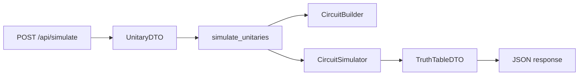

# Review: Task 1 backend notes and your questions

## Corrections (things that were wrong or imprecise)

- **Simulate endpoint is POST, not GET.** The route is defined with `def post(self)` in [`app/api/simulate.py`](QMCB-be/app/api/simulate.py); there is no GET handler for simulation.
- **`simulate_and_update` is not unused.** The controller calls it for every basis state for both trial and (when validating) target circuits ([`app/controllers/simulate.py`](QMCB-be/app/controllers/simulate.py) lines 56–72). What you likely meant as “NU” applies to **`run_and_measure`** and the **measurement** helpers (see below).
- **Two CORS configurations are intentional but overlapping.** [`app/__init__.py`](QMCB-be/app/__init__.py) applies `CORS(app, resources={r"/*": {"origins": config.ALLOWED_ORIGINS}})` (often `*` from env). [`app/main.py`](QMCB-be/app/main.py) then applies a **second** `CORS()` scoped to `r"/api/*"` with Vite dev URLs (`5173`). This is not “wrong,” but it is a layered setup: factory-level permissive origins plus entrypoint-level tightening for `/api/*`. Worth noting for production hardening.
- **`__init__.py` does not duplicate logging setup.** [`main.py`](QMCB-be/app/main.py) calls `logging.basicConfig(...)`. [`app/__init__.py`](QMCB-be/app/__init__.py) only does `logger = logging.getLogger(__name__)` for a module logger—standard pattern, not a second configuration.
- **“Validation mode” response key has a typo.** The controller returns `"validation_mode:": validate_target` (colon **inside** the string key) in [`app/controllers/simulate.py`](QMCB-be/app/controllers/simulate.py) line 87—clients would see `"validation_mode:"` not `"validation_mode"`.
- **`VALIDATE_TARGET_CIRCUITS`:** When `False` (default can be overridden via env), the backend **does not** simulate the target circuit; it fills the target truth table from **stored** `expected_outputs` in [`TARGET_LIBRARY`](QMCB-be/app/config/target_library.py) via [`build_target_truth_table`](QMCB-be/app/utils/helpers.py). When `True`, it **simulates** the target with `TargetUnitaryBuilder.build` and compares against the wavefunction-built table—useful to verify the library matches Cirq.
- **`TargetLibraryEntry` in [`types.py`](QMCB-be/app/utils/types.py) does not match the actual library shape.** Real entries use `num_qubits`, `steps` (list of `{gate, order}`), and `expected_outputs`. The `gates` / `qubit_order` fields on `TargetLibraryEntry` are **not** how the live `TARGET_LIBRARY` is structured; `LevelDefinition` / `GateStep` are closer. This is a documentation/type drift issue, not a runtime bug unless you start type-checking the dict against `TargetLibraryEntry`.
- **`target_library.py`:** There are no “magic strings” for gate **names** in the sense of raw strings everywhere—[`TargetLibraryField`](QMCB-be/app/utils/constants.py) and [`Gate`](QMCB-be/app/utils/constants.py) are used. **However**, [`TargetUnitaryBuilder.build`](QMCB-be/app/services/target_builder.py) still indexes with string literals `"steps"`, `"gate"`, `"order"` instead of `TargetLibraryField`—minor inconsistency.
- **`index_to_letter`:** Index **0** maps to `'a'`, not “1 → a”. The comment in your notes is off by one.

---

## Your questions answered

### CORS / Vite / `allow_headers`

- **What “allows the Vite dev server origins” means:** browsers block cross-origin requests unless the server allows the **origin** of the page (here, the frontend dev server on port `5173`). `CORS(..., origins=[...])` whitelists those origins for `/api/*`.
- **`methods`:** which HTTP verbs the browser may use in cross-origin requests (GET, POST, etc.).
- **`allow_headers`:** which **request headers** the browser is allowed to send on cross-origin requests (e.g. `Content-Type` for JSON bodies, `Authorization` if you add auth later). Without listing them, a preflight `OPTIONS` request might fail for non-simple headers.

### Why `ResponseDTO` / `to_dict`?

- **`TruthTableDTO.to_dict()`:** turns the dataclass into a plain `dict` so Flask can JSON-serialize it when building the response dict (see controller return). Same idea as `asdict` for nested structures.
- **`ResponseDTO`:** a small bag for **error** payloads. In [`app/api/simulate.py`](QMCB-be/app/api/simulate.py), `ResponseBuilder.error(..., data=ResponseDTO(error=str(e)))` puts structured error into the `data` field of the standardized error envelope. **Success** responses return the raw dict from the controller, not `ResponseBuilder.success`—so success and error JSON shapes differ today.

### `@staticmethod` on classes vs a module of functions

- **Not required for correctness**—it is largely organizational: grouping related functions under `CircuitSimulator` / `CircuitBuilder` / `CirqGateMapper` namespaces. Some teams prefer classes for discoverability and future instance state; here it is **stateless** static methods, equivalent to modules with functions.

### `measure_qubits` vs `run_and_measure` in `simulator.py`

- **`CircuitBuilder.measure_qubits`:** builds a **circuit fragment** that only adds `cirq.measure` ops (keys `a`, `b`, …). It is **not** used in the main app path; only referenced in [`testing/bug_testing.py`](QMCB-be/testing/bug_testing.py).
- **`CircuitSimulator.run_and_measure`:** runs a full circuit **with** sampling/measurement and returns a string of bits via `extract_results`. **Not called** from production code.
- **Production path:** `simulate_wavefunction` + `wavefunction_truth_table` via `simulate_and_update`—**no measurement**; outputs are Dirac strings from the state vector. So **not redundant with the live path**—they are an **alternate** (sampling) API that is currently unused.

### `get_unitary` in `target_builder.py`

- **`build()`** reads from `TARGET_LIBRARY`. **`get_unitary()`** duplicates the same circuits with **hardcoded** branches. **Grep shows no callers** in `app/`—safe to treat as legacy / dead unless you keep it for tests. Removing it reduces duplication; keeping it only helps if you want a reference without touching the library.

### `RequestKey` in `constants.py`

- Despite names like `METHOD`, `URL`, `headers`, **only** `STATUS`, `MESSAGE`, and `DATA` are used in [`response_builder.py`](QMCB-be/app/utils/response_builder.py). The rest of the enum looks like a **generic HTTP-client-style** template that was never wired in—cosmetic / future-use.

### `generate_basis_states` vs `constants` basis lists

- **`generate_basis_states(n)`** produces **all** `2^n` states as lists of ints `[[0,0],[0,1],...]` for **any** `n`—used in simulation.
- **`TWO_QUBIT_INPUTS` / `THREE_QUBIT_INPUTS`:** fixed string lists for **display / expected-output alignment** (e.g. [`build_target_truth_table`](QMCB-be/app/utils/helpers.py) zips `TWO_QUBIT_INPUTS` with `expected_outputs`). **3-qubit list is currently unused** in the app (no `grep` hits outside `constants.py`). **3-qubit cases** are not in the target-library builder path yet, which is **hardcoded to 2-qubit inputs**—a real limitation if you add 3-qubit targets.

### Why `qubit_orders.py` instead of `constants.py`

- **Separation of concerns:** [`constants.py`](QMCB-be/app/utils/constants.py) holds enums and global constants; [`qubit_orders.py`](QMCB-be/app/utils/qubit_orders.py) holds **reusable wire order lists** (`Q0`, `C0_T1`, …) imported by [`target_library.py`](QMCB-be/app/config/target_library.py). Keeping them in a small module avoids cluttering `constants` and makes imports clear. **No functional difference**; style preference.

### `ResponseBuilder` “in good shape?”

- **Works** for `error`/`fail`/`success` paths. **Inconsistency:** `simulate` success bypasses the envelope (`status`/`message`/`data`) and returns the controller dict directly. **Not a logic error**, but API contract inconsistency.

### TypedDict (`GateStep`, `TargetLibraryEntry`, `LevelDefinition`) vs DTOs

- **DTOs** (`UnitaryDTO`, `TruthTableDTO`): runtime objects with behavior, passed through the app and serialized with `to_dict` / `asdict`.
- **TypedDict** (`GateStep`, etc.): **static typing hints** for dict shapes; no runtime validation unless you add it. `TargetLibraryEntry` is **misaligned** with actual `TARGET_LIBRARY` (see above). `LevelDefinition` is odd subclassing `dict` with annotations—legacy style.

---

## (NU) items: usage and keep/remove

| Symbol | Verdict | Where used | Keep vs remove |
|--------|---------|------------|----------------|
| `simulate_and_update` | **Used** | Controller | **Keep** |
| `run_and_measure` | **Unused** in app | Only defined in [`simulator.py`](QMCB-be/app/services/simulator.py) | Remove if you commit to wavefunction-only API; keep for planned sampling mode |
| `measurement_truth_table` | **Unused** | Only defined | Same as above |
| `measure_qubits` | **Unused** in app | [`testing/bug_testing.py`](QMCB-be/testing/bug_testing.py) only | Remove or keep for experiments; comment in code already says “future” |
| `extract_results` | **Only** `run_and_measure` | [`helpers.py`](QMCB-be/app/utils/helpers.py) | Remove with measurement path |
| `extract_wavefunction` | **Unused** | Only defined | Candidate for removal |
| `get_unitary` | **Unused** | Only defined | Safe to remove if redundant with `build()` + tests updated |
| `THREE_QUBIT_INPUTS` | **Unused** | Only defined | Keep if you plan 3-qubit levels soon; else noise |

---

## Optional diagram: simulation data flow

---

## Summary

Your notes are strong on the high-level flow. The main fixes: **POST not GET**, **`simulate_and_update` is central (not NU)**, **measurement helpers are the unused branch**, **`RequestKey` is mostly envelope keys**, and **`TargetLibraryEntry` TypedDict is outdated**. The **`validation_mode:`** key typo is worth fixing when you implement.
